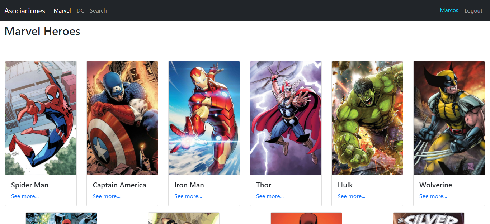

# HeroesApp

React app, from **Udemy course** "React: de cero a experto (Hooks y MERN)"

## Screenshot 📸

## Built with 🔨

- create-react-app
- [Bootstrap](https://getbootstrap.com/)
- [React-icons](https://react-icons.github.io/react-icons)
- React router
- State management with Context API
- Hooks (useState, useEffect, useMemo, useContext)
- localStorage

## Live demo 📎

[Link](https://heroes-app-seven.vercel.app)

### Author 🧔

[Marcos Pennachini](https://linkedin/in/marcos-pennachini)
